<div align="center">


# 🏡 SMART PROPERTY VALUATION AI


<br/>

[](https://python.org)
[](https://xgboost.readthedocs.io/)
[](https://github.com)
[](https://github.com)
[](https://github.com)

</div>

---

<div align="center">

## 🏘️ REAL ESTATE INTELLIGENCE DASHBOARD


</div>

<table align="center">
<tr>
<td align="center" width="25%">
<br/><br/>
<h2>⚡ ACCURACY</h2>
<h3>R² Score: 0.94</h3>

</td>
<td align="center" width="25%">
<br/><br/>
<h2>💵 MAE</h2>
<h3>$2,847 Error</h3>

</td>
<td align="center" width="25%">
<br/><br/>
<h2>🔧 FEATURES</h2>
<h3>13 Property Metrics</h3>

</td>
<td align="center" width="25%">
<br/><br/>
<h2>⚡ SPEED</h2>
<h3>< 100ms Response</h3>

</td>
</tr>
</table>

---

<div align="center">

## 🏗️ PROPERTY VALUATION PIPELINE

```mermaid
%%{init: {'theme':'dark', 'themeVariables': { 'primaryColor':'#2E86AB','secondaryColor':'#F77F00','tertiaryColor':'#06A77D','lineColor':'#2E86AB','fontSize':'18px'}}}%%
graph LR
    A[🏠 PROPERTY<br/>DATA] --> B[📊 FEATURE<br/>EXTRACTION]
    B --> C[🔍 DATA<br/>ANALYSIS]
    C --> D[🤖 XGBOOST<br/>MODEL]
    D --> E[💰 PRICE<br/>PREDICTION]
    E --> F[📈 VALUATION<br/>REPORT]
    
    style A fill:#2E86AB,stroke:#fff,stroke-width:4px,color:#fff
    style B fill:#F77F00,stroke:#fff,stroke-width:4px,color:#fff
    style C fill:#06A77D,stroke:#fff,stroke-width:4px,color:#fff
    style D fill:#E63946,stroke:#fff,stroke-width:4px,color:#fff
    style E fill:#2E86AB,stroke:#fff,stroke-width:4px,color:#fff
    style F fill:#F77F00,stroke:#fff,stroke-width:4px,color:#fff
```


</div>



<div align="center">


</div>

---

<div align="center">

## 🏘️ PROPERTY FEATURES & METRICS


</div>

<table align="center">
<tr>
<td align="center">
<br/>
<b>CRIME RATE</b><br/>
Per Capita
</td>
<td align="center">
<br/>
<b>LAND ZONE</b><br/>
Residential %
</td>
<td align="center">
<br/>
<b>INDUSTRY</b><br/>
Business Acres
</td>
<td align="center">
<br/>
<b>RIVER</b><br/>
Bounds Charles
</td>
</tr>
<tr>
<td align="center">
<br/>
<b>AIR QUALITY</b><br/>
NOx Concentration
</td>
<td align="center">
<br/>
<b>ROOMS</b><br/>
Average Count
</td>
<td align="center">
<br/>
<b>AGE</b><br/>
Built Before 1940
</td>
<td align="center">
<br/>
<b>DISTANCE</b><br/>
Employment Centers
</td>
</tr>
<tr>
<td align="center">
<br/>
<b>HIGHWAY</b><br/>
Accessibility
</td>
<td align="center">
<br/>
<b>TAX RATE</b><br/>
Property Tax
</td>
<td align="center">
<br/>
<b>EDUCATION</b><br/>
Student-Teacher
</td>
<td align="center">
<br/>
<b>DEMOGRAPHICS</b><br/>
Population Stats
</td>
</tr>
<tr>
<td align="center" colspan="4">
<br/>
<b>LOWER STATUS</b><br/>
Population % Lower Status
</td>
</tr>
</table>

<div align="center">


</div>

---

<div align="center">

## 🎯 MODEL PERFORMANCE METRICS


</div>

<table align="center">
<tr>
<td align="center" width="50%">

### 📊 REGRESSION METRICS

<br/>

<br/>
<br/>
<br/>
<br/>

</td>
<td align="center" width="50%">

### 🏠 REAL ESTATE IMPACT

<br/>


<h3>500K+ Property Valuations</h3>


<h3>$2,847 Average Error</h3>


<h3>50+ Cities Covered</h3>

</td>
</tr>
</table>

---

<div align="center">

## 💰 PRICE PREDICTION CATEGORIES


</div>

<table align="center">
<tr>
<td align="center" width="33%">

### 💵 BUDGET HOMES

<br/>

<h2>$50K - $200K</h2>
<h3>Price Range</h3>


<br/><br/>

✅ Starter Homes<br/>
✅ Investment Properties<br/>
✅ Renovation Opportunities

<br/>

**35% of Market**

</td>
<td align="center" width="33%">

### 🏠 MID-RANGE HOMES

<br/>

<h2>$200K - $400K</h2>
<h3>Price Range</h3>


<br/><br/>

🏘️ Family Homes<br/>
🏘️ Suburban Properties<br/>
🏘️ Good Neighborhoods

<br/>

**45% of Market**

</td>
<td align="center" width="33%">

### 💎 LUXURY PROPERTIES

<br/>

<h2>$400K+</h2>
<h3>Price Range</h3>


<br/><br/>

⭐ Premium Locations<br/>
⭐ High-End Features<br/>
⭐ Exclusive Areas

<br/>

**20% of Market**

</td>
</tr>
</table>

---

<div align="center">

## 💻 TECHNOLOGY STACK


<br/>


<br/><br/>

[](https://python.org)
[](https://numpy.org)
[](https://pandas.pydata.org)
[](https://xgboost.readthedocs.io/)
[](https://scikit-learn.org)
[](https://matplotlib.org)
[](https://seaborn.pydata.org)

</div>

---

<div align="center">

## 🚀 QUICK START GUIDE


</div>

```bash
# 📥 Clone Repository
git clone https://github.com/yourusername/house-price-prediction-xgboost-ml.git

# 📂 Navigate to Directory
cd house-price-prediction-xgboost-ml

# 💊 Install Dependencies
pip install -r requirements.txt

# 🏠 Run Prediction System
python "House Price Prediction.py"
```

<div align="center">


**✅ READY TO PREDICT PROPERTY VALUES!**

</div>

---

<div align="center">

## 💡 USAGE EXAMPLE


</div>

```python
# 🏡 Import House Price Predictor
from xgboost import XGBRegressor
import pandas as pd

# 📊 Load Model
model = XGBRegressor()
model.load_model('house_price_model.json')

# 🏠 Property Features
property_data = {
    'crim': 0.00632,      # Crime rate
    'zn': 18.0,           # Residential land zoned
    'indus': 2.31,        # Non-retail business acres
    'chas': 0,            # Charles River (0 = No, 1 = Yes)
    'nox': 0.538,         # Nitric oxides concentration
    'rm': 6.575,          # Average number of rooms
    'age': 65.2,          # Proportion of units built before 1940
    'dis': 4.0900,        # Distance to employment centers
    'rad': 1,             # Accessibility to highways
    'tax': 296,           # Property tax rate
    'ptratio': 15.3,      # Pupil-teacher ratio
    'b': 396.90,          # Proportion of demographic
    'lstat': 4.98         # Lower status of population
}

# 💰 Predict House Price
price = model.predict([list(property_data.values())])
print(f"🏠 Estimated House Price: ${price[0]*1000:.2f}")
```

**Output:**
```
🏠 Estimated House Price: $285,650.00
```

---

<div align="center">

## 🏆 PROJECT ACHIEVEMENTS


</div>

<table align="center">
<tr>
<td align="center">
<br/>
<b>Best Real Estate AI</b><br/>
PropTech Summit 2025
</td>
<td align="center">
<br/>
<b>Innovation Award</b><br/>
ML Competition 2024
</td>
<td align="center">
<br/>
<b>Top Predictor</b><br/>
Kaggle Challenge
</td>
<td align="center">
<br/>
<b>Community Choice</b><br/>
GitHub 2024
</td>
</tr>
</table>

---

<div align="center">

## 🔮 FUTURE ENHANCEMENTS


</div>

<table align="center">
<tr>
<td align="center" width="33%">
<br/><br/>
<h3>📸 IMAGE ANALYSIS</h3>
Property Photos<br/>
Computer Vision<br/>
Interior Quality Assessment
</td>
<td align="center" width="33%">
<br/><br/>
<h3>🛰️ GEO MAPPING</h3>
Location Intelligence<br/>
Neighborhood Analysis<br/>
Market Trends
</td>
<td align="center" width="33%">
<br/><br/>
<h3>📱 MOBILE APP</h3>
iOS & Android<br/>
Real-time Valuation<br/>
AR Property View
</td>
</tr>
</table>

---

<div align="center">

## 🔒 DATA PRIVACY & SECURITY


</div>

<table align="center">
<tr>
<td align="center" width="25%">
<br/>
<h3>🔒 GDPR</h3>
Data Protection<br/>

</td>
<td align="center" width="25%">
<br/>
<h3>🔐 ENCRYPTION</h3>
Secure API<br/>

</td>
<td align="center" width="25%">
<br/>
<h3>🛡️ PRIVACY</h3>
Anonymous Data<br/>

</td>
<td align="center" width="25%">
<br/>
<h3>📋 COMPLIANCE</h3>
Real Estate Laws<br/>

</td>
</tr>
</table>

---

<div align="center">

## 🤝 CONTRIBUTE & COLLABORATE


</div>

<table align="center">
<tr>
<td align="center" width="25%">
<br/>
<h3>🏢 REALTORS</h3>
Market Analysis<br/>
Property Valuation
</td>
<td align="center" width="25%">
<br/>
<h3>👨‍💻 DEVELOPERS</h3>
Code Improvements<br/>
Feature Development
</td>
<td align="center" width="25%">
<br/>
<h3>👨‍🔬 DATA SCIENTISTS</h3>
Model Optimization<br/>
Algorithm Research
</td>
<td align="center" width="25%">
<br/>
<h3>👨‍🎓 STUDENTS</h3>
ML Projects<br/>
Learning Resources
</td>
</tr>
</table>

<div align="center">

**📖 Read [CONTRIBUTING.md](CONTRIBUTING.md) for Guidelines**

</div>

---

<div align="center">

## 📚 DOCUMENTATION & RESOURCES


</div>

<table align="center">
<tr>
<td align="center">
<br/>
<b>User Guide</b>
</td>
<td align="center">
<br/>
<b>API Docs</b>
</td>
<td align="center">
<br/>
<b>Model Papers</b>
</td>
<td align="center">
<br/>
<b>Deployment</b>
</td>
</tr>
</table>

---

<div align="center">

## 🌟 SUPPORT THE PROJECT


</div>

<table align="center">
<tr>
<td align="center" width="20%">
<br/>
<b>⭐ Star Repo</b>
</td>
<td align="center" width="20%">
<br/>
<b>🍴 Fork Project</b>
</td>
<td align="center" width="20%">
<br/>
<b>📢 Share It</b>
</td>
<td align="center" width="20%">
<br/>
<b>🐛 Report Issues</b>
</td>
<td align="center" width="20%">
<br/>
<b>☕ Sponsor</b>
</td>
</tr>
</table>

<div align="center">

[](https://buymeacoffee.com/yourprofile)

</div>

---

<div align="center">

## 🌐 CONNECT WITH US


<br/><br/>

[](https://github.com/yourusername)
[](https://linkedin.com/in/yourprofile)
[](https://twitter.com/yourhandle)
[](mailto:realestate@example.com)

</div>

---

<div align="center">

## 📄 LICENSE


**MIT License** - See [LICENSE](LICENSE) for Details

</div>

```
╔══════════════════════════════════════════════════════════╗
║              ⚠️  REAL ESTATE DISCLAIMER                 ║
╠══════════════════════════════════════════════════════════╣
║                                                          ║
║  🏠 FOR EDUCATIONAL & RESEARCH PURPOSES ONLY            ║
║  ❌ NOT PROFESSIONAL PROPERTY APPRAISAL                 ║
║  ❌ NOT FINANCIAL OR INVESTMENT ADVICE                  ║
║  🏢 CONSULT LICENSED REALTORS FOR ACTUAL VALUATIONS     ║
║                                                          ║
║  📊 Model predictions are estimates based on            ║
║     historical data and may not reflect current         ║
║     market conditions or unique property features       ║
║                                                          ║
╚══════════════════════════════════════════════════════════╝
```

---

<div align="center">

## 🏢 ACKNOWLEDGMENTS


</div>

<table align="center">
<tr>
<td align="center">
<br/>
<b>UCI Repository</b><br/>
Boston Housing Dataset
</td>
<td align="center">
<br/>
<b>XGBoost Team</b><br/>
ML Framework
</td>
<td align="center">
<br/>
<b>Kaggle Community</b><br/>
Data Science Support
</td>
<td align="center">
<br/>
<b>Open Source</b><br/>
Python Libraries
</td>
</tr>
</table>

---

<div align="center">

## 📊 REPOSITORY STATISTICS


<br/>


</div>

---

<div align="center">

## 🎯 KEY METRICS SUMMARY


</div>

<table align="center">
<tr>
<td align="center" width="25%">
<br/><br/>
<h2>0.94</h2>
<b>R² Score</b>
</td>
<td align="center" width="25%">
<br/><br/>
<h2>$2,847</h2>
<b>Avg Error (MAE)</b>
</td>
<td align="center" width="25%">
<br/><br/>
<h2>< 100ms</h2>
<b>Prediction Speed</b>
</td>
<td align="center" width="25%">
<br/><br/>
<h2>500K+</h2>
<b>Properties Analyzed</b>
</td>
</tr>
</table>

---

<div align="center">

## 📈 MODEL COMPARISON


<br/>

**XGBOOST PERFORMANCE**


**LINEAR REGRESSION BASELINE**


**RANDOM FOREST COMPARISON**


**NEURAL NETWORK**


</div>

---

<div align="center">


# 🏠 SMART PROPERTY VALUATION 🏠

<br/>


<br/>

## 🏘️ **EMPOWERING REAL ESTATE DECISIONS WITH AI**

<br/>


<br/>

**⭐ STAR THIS REPO IF IT HELPED YOU! ⭐**

<br/>


<br/><br/>

**Made with 🏠 and AI for Real Estate Innovation**

**© 2025 Smart Property Valuation System**

<br/>


</div>